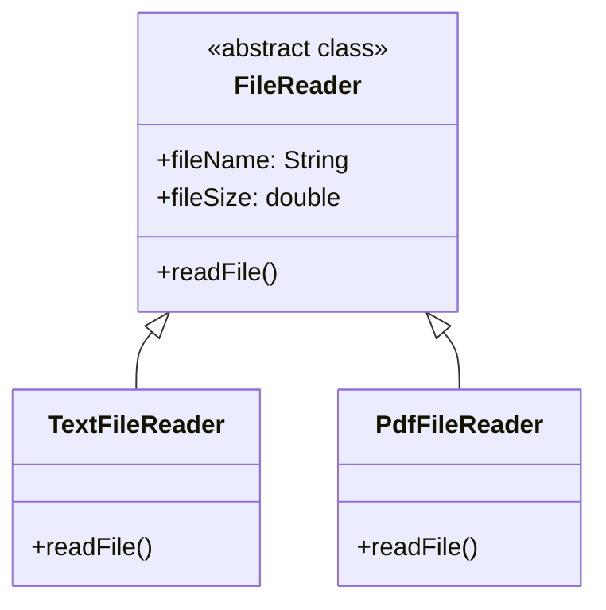

# design-principles
This repository contains my learnings on software design principles

# SOLID principles

Robert C. Martin created this 'collection' of design principles.

As these principles are talking about the fundamentals software system design, I am observing some kind of relationships amont them and I am trying to capture those relationships here.

For deep understandings on these principles : http://principles-wiki.net/collections:solid

SOLID is an acronyme for the following principles:

S --> Single Responsibility Principle ( SRP )

O --> Open Closed Principle ( OCP )

L --> Liskov Substitution Principle ( LSP )

I --> Interface Segregation Principle ( ISP )

D --> Dependency Inversion Principle ( DIP )


# Single Responsibility Principle & Open Closed Principle

When anyone is trying to address the issues that are related to **'Open Closed Principle'**   they may naturally address the problems that are related to **'Single Responsibility Principle'**.

Say someone wants to extend the behavior of particular a class. The options are:

1. do modifications in existing methods.
2. add more methods and attributes
3. create sub classes by extending this class with more functionalities.

If we choose option (1) and/or (2), then these approaches violate both SRP and OCP principles.

Following are the difficulties that we will face with the options (1) and (2)

1. If we open an existing class and modify it, it will introduce the following difficulties:
- If we change any exisiting method, then regression testing effort is needed or at least we will require 
	to modify existing unit test cases.
- If we add new attributes and methods, a) this may introduce regression testing efforts. b) it may introduce bugs in other classes that are already using this class.

So we have to choose the option3 to extend the behavior of a class. This option3 falls under implementing  **'Open Closed Principle'** 

If we don't want to open an existing class and make some changes very often, then that should have only one responsibility. Hence it will have only one reason to change.
This is called as **Single Responsibility principle**.

Following example illustrates this relationship.

```
Initially this class supports only one type of file '.txt' file.

public class FileReader {
    private String fileName;
    private double fileSize;

    //reads only .txt file
    public void readFile() {

    }
}
```

We want to extend this class to support ".pdf"  files as well. then this class will become like below.

```
public class FileReader {
    private String fileName;
    private double fileSize;
    private String fileType;

    public void readFile() {
        switch(this.fileType) {
            case "text" :
                //read text file
                break;

            case "pdf" :
                // read pdf file
                break;
        }
    }
}
```

Now this class violates both SRP and OCP priciples. These violations can be fixed as below.


